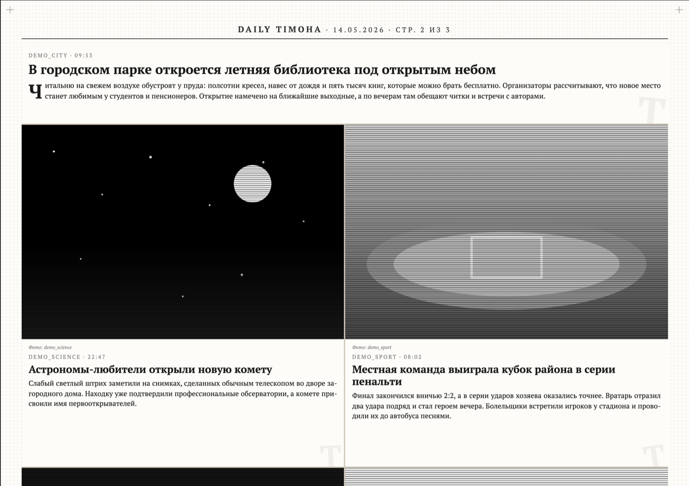
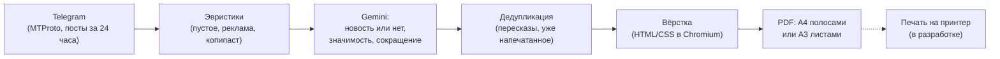

# 🗞️ TG Newspaper

**Утренняя газета из ваших Telegram-каналов: нажали кнопку — получили номер, который можно прочитать за чашкой кофе и закрыть.**

[](https://github.com/tiltozavr2545/tg_newspaper/releases/latest)


### [⬇️ Скачать для macOS и Windows](https://github.com/tiltozavr2545/tg_newspaper/releases/latest)

<p align="center">
  
</p>

<sub>Демо-номер собран из выдуманных новостей: настоящие номера содержат посты ваших каналов, поэтому в репозитории их нет.</sub>

## 📰 Что это

Лента в Telegram бесконечна: открыл «на минутку» — и пропал на час. TG Newspaper заменяет утренний скроллинг **печатным номером фиксированного объёма**. Лента закончилась — газета закончилась.

- 📥 Берёт посты ваших каналов **за последние 24 часа** от момента нажатия кнопки. Никакого расписания и автозапуска: номер собирается, только когда вы сами нажмёте «Собрать газету».
- 🧹 Отсеивает «не новости» (рекламу, пустые посты, медиа без подписи) и дубли — когда одна новость разошлась по нескольким каналам.
- ⚖️ Нейросеть оценивает значимость каждой новости. Самое важное идёт в номер первым, длинное, но важное — сокращается, проходное — не попадает.
- 🗞️ Верстает номер: **обложка-афиша** в стиле таблоида (крикливые анонсы и кадры, статей на ней нет) и **до 4 полос новостей**. Все тексты на полосах печатаются целиком.
- 🎯 **Учится на ваших интересах**: короткий онбординг при первом запуске и опрос после каждого номера («расставьте 5 постов по важности») подстраивают отбор под вас.
- 📄 Отдаёт готовый номер в PDF: полосами A4 или склеенными листами A3.

Всё работает **на вашем компьютере**: ключи и данные не уходят никуда, кроме самих Telegram и Gemini.

<p align="center">
  
</p>

## ⚙️ Как это работает



Telegram читается под обычным пользовательским аккаунтом (не через бота), потому что только так можно разово забрать историю канала за прошедшие сутки. Подробности — в конце README, в разделе «Для разработчиков».

## 💾 Установка

Нужен компьютер с macOS или Windows и интернет.

### macOS

1. Откройте страницу [Releases](https://github.com/tiltozavr2545/tg_newspaper/releases/latest) и скачайте **`TG-Newspaper-<версия>-mac.dmg`**.
2. Откройте dmg и перетащите **TG Newspaper** в «Программы».
3. Первое открытие. Приложение **без цифровой подписи**, поэтому macOS спросит подтверждение:
   - правый клик по приложению → **«Открыть»** → **«Открыть»**;
   - либо запустите как обычно, затем «Системные настройки» → «Конфиденциальность и безопасность» → **«Всё равно открыть»**.

### Windows

1. На странице [Releases](https://github.com/tiltozavr2545/tg_newspaper/releases/latest) скачайте **`TG-Newspaper-<версия>-windows-setup.exe`** и запустите его. Права администратора не нужны, программа ставится в `%LOCALAPPDATA%\Programs\TG Newspaper`, ярлык появляется в меню «Пуск» (ярлык на рабочем столе — по желанию, галочка в установщике).
2. Если SmartScreen показал «Windows защитила ваш компьютер» (установщик не подписан) — нажмите **«Подробнее»** → **«Выполнить в любом случае»**.

### Первый запуск

При первом запуске программа сама ставит всё, что ей нужно: менеджер [uv](https://docs.astral.sh/uv/), Python, библиотеки и браузер Chromium для вёрстки. Это занимает **2–3 минуты, нужен интернет**. Пока идёт подготовка, в браузере открыта страница ожидания, а потом она сама переходит в консоль на `http://localhost:8420/`. Консоль доступна только с вашего компьютера.

Следующие запуски быстрые. Повторный клик по иконке, пока консоль работает, просто открывает ещё одну вкладку.

## 🧭 Настройка

Пока проект не настроен, консоль сама ведёт на **мастер настройки** из четырёх шагов — править файлы вручную не нужно. Любой шаг можно пройти заново позже (ссылка **«Настройки»** на главной странице).

Вам понадобится:

| Что | Зачем | Где взять |
|---|---|---|
| Отдельный Telegram-аккаунт | читать каналы | свой номер телефона |
| `api_id` и `api_hash` | доступ к Telegram API | [my.telegram.org](https://my.telegram.org) |
| Ключ Gemini | нейросеть отбирает и оценивает новости | [Google AI Studio](https://aistudio.google.com/app/apikey) |
| Cloudflare Worker | прокси до Gemini (без него Gemini из РФ не отвечает) | бесплатный аккаунт [Cloudflare](https://dash.cloudflare.com) |
| Список каналов | что читать | вы сами |

### Шаг 1. Telegram API

> ⚠️ **Заведите для проекта отдельный аккаунт Telegram, не личный.** Программа входит в Telegram как человек, а файл сессии, который при этом создаётся, — это ключ ко всему аккаунту (не токен с ограниченными правами). Если он когда-нибудь утечёт, пострадает только отдельный аккаунт, а не ваш основной.

1. Откройте [my.telegram.org](https://my.telegram.org) и войдите по номеру телефона **этого отдельного аккаунта** (код придёт в Telegram).
2. Выберите **«API development tools»** и создайте приложение: название и короткое имя — любые.
3. Скопируйте **`api_id`** (число) и **`api_hash`** (длинная строка).
4. В мастере вставьте их в карточку **«1. Telegram API»** и нажмите «Сохранить». Поле «Имя файла сессии» можно не менять.

Бот-токен не нужен: программа читает каналы как пользователь.

### Шаг 2. Вход в Telegram

В карточке **«2. Вход в Telegram»**:

1. Введите номер телефона аккаунта проекта (в формате `+79991234567`) → «Отправить код».
2. Введите код, который Telegram пришлёт в приложение (обычно не по SMS) → «Войти».
3. Если включена двухфакторная защита, дальше спросят пароль.

Когда всё получилось, в карточке появится «Вход выполнен: имя аккаунта». Ошиблись номером — кнопка «Начать заново».

### Шаг 3. Gemini и прокси Cloudflare

Для отбора и оценки новостей используется нейросеть **Gemini** (хватает бесплатного тарифа). Напрямую из России она не отвечает: `User location is not supported`. Поэтому **прокси через свой Cloudflare Worker обязателен**: Google видит адрес Cloudflare, а не ваш, и запросы проходят. Мастер не засчитает этот шаг, пока адрес прокси не заполнен.

**3.1. Ключ Gemini.** Откройте [Google AI Studio](https://aistudio.google.com/app/apikey), создайте API-ключ и скопируйте его.

**3.2. Создайте Worker** (это делается один раз и занимает несколько минут):

1. Зайдите на <https://dash.cloudflare.com> (при необходимости бесплатно зарегистрируйтесь) → **Workers & Pages** → **Create** → **Worker**.
2. Дайте имя, например `tg-newspaper-gemini`, и нажмите **Deploy**.
3. Нажмите **Edit code**, удалите всё, что там есть, и вставьте содержимое файла [`cloudflare-worker.js`](cloudflare-worker.js) из этого репозитория. Это небольшой скрипт, который пересылает запросы к Gemini API; пропускает он только пути Gemini. Строку `PROXY_SECRET` оставьте пустой.
4. Снова нажмите **Deploy**.
5. Скопируйте адрес воркера вида `https://tg-newspaper-gemini.ВАШ-АККАУНТ.workers.dev`.

**3.3. Заполните карточку «3. Gemini» в мастере:**

| Поле | Что вписать |
|---|---|
| `GEMINI_API_KEY` | ключ из AI Studio |
| Модель | по умолчанию `gemini-3.5-flash-lite`, можно не менять |
| `GEMINI_BASE_URL` (обязательно) | адрес вашего воркера. Только `https://`, слэш в конце срежется сам |

Нажмите **«Сохранить и проверить»**: программа сделает один дешёвый запрос к Gemini именно через ваш прокси и скажет, что не так (ключ не принят, модель не найдена, прокси недоступен, регион не поддерживается).

### Шаг 4. Каналы

В карточке **«4. Каналы»** впишите каналы-источники **по одному на строку**. Подойдёт любой вид записи:

```
durov
@telegram
https://t.me/example_channel
```

Программа сохранит чистые имена каналов. Нажмите **«Сохранить и проверить доступ»**: каждый канал проверяется через вашу сессию, и рядом с ним появится «доступен: название канала» или причина, почему не вышло (такого канала нет, канал приватный, это пользователь или бот).

О подписке на каналы: аккаунт проекта удобно **подписать на все каналы-источники** (так задумано в плане проекта). Публичные каналы мастер проверяет по имени. Приватные каналы работают, только если аккаунт в них состоит, но ссылки-приглашения вида `t.me/+...` не поддерживаются: нужен публичный `username`.

### Онбординг

Когда все четыре шага зелёные, мастер предложит **онбординг** (`/onboarding`) — пару минут про вас:

- два текстовых поля: «Что интересно» и «Что неинтересно» (темы, каналы, форматы, свободным текстом);
- до трёх раундов по 5 реальных постов из ваших каналов: расставьте их по важности, где 1 — самое важное. Раундов не будет, пока в базе нет прошлых прогонов, тогда сохранится только текст.

Пока онбординг не пройден, кнопка сборки не запускает прогон. Если не хочется — есть кнопка «Пропустить»: газета тогда просто будет без персональной подстройки.

## 🖨️ Как пользоваться

1. Откройте **TG Newspaper** (иконка в «Программах» или в меню «Пуск»). В браузере откроется консоль.
2. Нажмите **«🗞️ Собрать газету»**. Программа заберёт посты за последние 24 часа, отфильтрует их, уберёт дубли и свёрстает номер. Это занимает **несколько минут** (чтение Telegram, запросы к Gemini, вёрстка), страница обновится сама.
3. Откроется **страница прогона**: сверху блок «Номер», ниже таблица всех постов с пометками «пошёл» или «отсеян» и причиной.

В блоке «Номер»:

- **превью полос**: клик по картинке открывает полосу крупно;
- **«Скачать PDF — N полос A4»**: каждая полоса на отдельной странице A4 (альбомной), печатается на обычном принтере;
- **«Скачать PDF — N листа A3»**: то же самое, но по две полосы на лист формата A3 (297 × 420 мм). Полосы идут вплотную одна над другой без швов, и лист выглядит как единая страница. Так верстается и обложка: на ней один лист из двух полос;
- **«Пересобрать номер»**: свёрстать заново по тому же прогону (если, например, что-то пошло не так при вёрстке: сам отбор при этом сохраняется).

Сколько в номере полос: обложка (2 полосы A4 = 1 лист A3) плюс до 4 полос новостей. Если новостей мало, номер получится короче.

PDF создаётся при первом скачивании (несколько секунд) и дальше берётся из кэша.

**Опрос после номера.** На главной появится блок «Оцените прошлый номер». В опросе 5 постов (часть была в номере, часть не поместилась): расставьте их по важности, 1 — самое важное. Подсказок нет специально: оценки модели и пометка «в номере» показываются только после отправки, на странице сравнения. Чем больше опросов, тем лучше газета угадывает ваш вкус; на главной видно, растёт ли совпадение с вашим порядком.

**Как выключить.** Кнопка **«Выключить консоль»** внизу главной страницы (рядом написана версия программы). Запустить снова можно той же иконкой.

## 🔒 Где хранятся данные и безопасность

Данные лежат **вне программы**:

| Система | Папка |
|---|---|
| macOS | `~/Library/Application Support/TG Newspaper` |
| Windows | `%LOCALAPPDATA%\TG Newspaper` |

Внутри:

| Что | Где |
|---|---|
| Ключи (`TG_API_HASH`, `GEMINI_API_KEY`, адрес прокси) | `.env` |
| Сессия Telegram | файл `tg_newspaper.session` (имя можно сменить в шаге 1) |
| Список каналов | `config/channels.yaml` |
| База (посты, прогоны, профиль читателя, отзывы) | `data/` |
| Готовые номера: полосы и PDF | `data/issues/run_<номер прогона>/` |
| Логи | `data/console.log`, `data/setup.log` |

Про безопасность:

- Ключи хранятся **только на вашем компьютере**. Файлы `.env` и сессии создаются с правами только для владельца (0600).
- В интерфейсе секреты показываются в маске (`••••1234`), в логи не пишутся. Пустое поле секрета при повторной настройке значит «не менять».
- Ключи не попадают в репозиторий и в установщик: они появляются только в вашей папке данных.
- Наружу программа ходит только в Telegram и в Gemini (через ваш прокси). Консоль слушает только `localhost`.

**Удаление.** Деинсталляция (перетаскивание приложения в корзину на macOS, «Приложения» в Windows) **данные не трогает**: настройки, сессия и номера останутся. Чтобы стереть всё, удалите папку данных из таблицы выше вручную.  Закрыть сессию совсем можно и в самом Telegram: «Настройки» → «Устройства».

## 🔄 Обновление

Скачайте новую версию со страницы [Releases](https://github.com/tiltozavr2545/tg_newspaper/releases/latest) и установите поверх старой (на macOS — заменить приложение в «Программах»). **Данные сохранятся**: они лежат в отдельной папке. После обновления первый запуск может ещё раз подготовить окружение, это занимает пару минут.

## 🛟 Если что-то не работает

| Что случилось | Что делать |
|---|---|
| macOS: «приложение повреждено» / не открывается | Приложение не подписано. Правый клик → «Открыть», либо «Системные настройки» → «Конфиденциальность и безопасность» → «Всё равно открыть». |
| Windows: SmartScreen | «Подробнее» → «Выполнить в любом случае». |
| Страница ожидания висит дольше 5 минут | Проверьте интернет. Если окружение не поставилось, программа покажет окно с ошибкой; подробности в `data/setup.log` в папке данных. |
| «Консоль не поднялась за 90 секунд» | Откройте `data/console.log` (на Windows ещё и `data/console.err.log`) в папке данных: там причина. |
| Консоль не открывается по адресу `http://localhost:8420/` | Порт **8420** занят другой программой или консоль не запустилась. Закройте то, что его занимает, и откройте TG Newspaper снова; лог — `data/console.log`. |
| `User location is not supported` | Gemini видит ваш регион как неподдерживаемый: проверьте, что в `GEMINI_BASE_URL` стоит адрес вашего воркера, а воркер задеплоен. Проверить вручную: откройте `https://<ваш-воркер>.workers.dev/v1beta/models?key=ВАШ_КЛЮЧ`: должен вернуться список моделей, а не ошибка региона. |
| «Ключ не принят Gemini» | Создайте ключ заново в Google AI Studio. |
| «Модель не найдена» | Проверьте название модели и адрес прокси: воркер пропускает только пути, начинающиеся с `/v1`. |
| Канал в мастере «не найден» | Проверьте `username`; для приватных каналов аккаунт проекта должен в них состоять. |
| Кнопка «Собрать газету» ведёт на онбординг | Пройдите его или нажмите «Пропустить». |
| Шрифты на Windows выглядят иначе | Шрифты «PT Serif» и «Superclarendon» есть в macOS; на Windows вёрстка использует запасные (Georgia, Times). Переносы и разбивка по полосам при этом всё равно считаются в браузере, но вид будет отличаться. |
| Прогон упал | Страница «Прогон не удался» покажет причину (сбой Telegram или Gemini); сохранённые прогоны остаются, можно нажать кнопку ещё раз. |

## 🗺️ Статус и планы

Первая версия [выпущена](https://github.com/tiltozavr2545/tg_newspaper/releases/tag/v0.1.0): готовые приложения для macOS и Windows.

| Этап | Что | Состояние |
|---|---|---|
| 0–1 | Подготовка, сбор истории каналов | ✅ |
| 2 | Фильтрация и дедупликация | ✅ |
| 3 | Вёрстка и рендер номера | ✅ |
| 5 | Консоль с кнопкой, мастер настройки, номер и PDF прямо на странице прогона, установщики | ✅ |
| 6 | Персонализация: онбординг, опросы, личная оценка значимости | ✅ (проверка на живых данных ещё впереди) |
| 4 | **Печать на принтер** по локальной сети | ⏳ в разработке |
| 7 | Рубрики: каналы группируются в секции, сводка «вышли новые видео» | 🔜 |
| 8 | Управление каналами и порогами фильтрации в самом интерфейсе | 🔜 |

Подробнее: [бриф проекта](docs/project-brief.md), [план реализации](docs/implementation-plan.md), [отложенное и открытые вопросы](docs/future-development.md).

Пока печать не готова, PDF из консоли можно распечатать любым принтером самостоятельно.

---

## 🛠️ Для разработчиков

<details>
<summary>Запуск из исходников, структура кода, релизы</summary>

### Запуск из исходников

Нужен [uv](https://docs.astral.sh/uv/) (`curl -LsSf https://astral.sh/uv/install.sh | sh`).

```bash
uv sync
uv run playwright install chromium
uv run python scripts/console.py     # консоль на http://localhost:8420/
uv run tg-newspaper                  # тот же прогон из терминала, без браузера
uv run python scripts/render_preview.py [run_id] [--pages N]   # пересборка номера по сохранённому прогону
```

В режиме разработки всё лежит в репозитории: `.env`, `config/channels.yaml`, `data/`, файл сессии. Скопировать шаблоны можно вручную (`.env.example`, `config/channels.example.yaml`), а сессию получить терминальным `uv run python scripts/telethon_login.py`, но проще пройти тот же мастер в консоли.

**Одна кнопка на macOS.** `scripts/make_app.sh` создаёт `~/Applications/TG Newspaper.app` (другой каталог — первым аргументом): консоль поднимается в фоне и открывается в браузере. Вся логика запуска — в `scripts/launch.sh`.

**Переменные окружения** (для проверок, в обычной работе не задаются): `TG_NEWSPAPER_HOME` — базовый каталог всех данных пользователя (так работает релиз), точечные `TG_NEWSPAPER_ENV`, `TG_NEWSPAPER_CHANNELS`, `TG_NEWSPAPER_SESSION_DIR`, `TG_NEWSPAPER_DB`; для лаунчеров — `TG_NEWSPAPER_PORT`, `TG_NEWSPAPER_RUN_DIR`, `TG_NEWSPAPER_NO_OPEN`.

**Демо-картинки для README:** `uv run python scripts/make_demo_images.py` (синтетические посты, без Telegram и Gemini).

### Структура

```
docs/                      — бриф, план реализации, отложенное и открытые вопросы
cloudflare-worker.js       — прокси до Gemini
src/tg_newspaper/          — сам пайплайн
scripts/                   — консоль, лаунчеры, сборка релиза
packaging/                 — установщик Windows, иконки, текст релиза
```

| Модуль (`src/tg_newspaper/`) | Что делает |
|---|---|
| `collector.py` | сбор истории каналов через Telethon |
| `filtering.py`, `dedup.py`, `paraphrase_dedup.py`, `history_dedup.py` | эвристики, копипаст-дедуп, дедуп пересказов, дедуп против напечатанного в последних 5 номерах |
| `classifier.py` | Gemini: новость или нет, значимость, сокращение текста, анонсы обложки |
| `personalization.py`, `feedback.py` | профиль читателя, персональная оценка значимости, подбор постов для опросов и метрика совпадения порядка |
| `layout.py` | мозаичная вёрстка и рендер номера в PNG (Playwright/Chromium) |
| `issue_pdf.py` | PDF номера из PNG-полос: A4 по полосам или склеенные листы A3 |
| `pipeline.py` | единый прогон: сбор → фильтрация → сборка номера |
| `storage.py` | SQLite: посты, прогоны, состав номеров, профиль читателя, отзывы |
| `setup_wizard.py`, `setup_html.py` | логика и страница мастера настройки |
| `report_html.py`, `feedback_html.py` | страницы консоли: главная, прогон, онбординг, опрос, сравнение |
| `config.py` | пути данных (всегда через его функции, не от `__file__`) |

### Как выпустить релиз

Версия — по PEP 440 (`0.2.0`, `0.2.0rc1`), берётся из тега:

```bash
git tag v0.2.0 && git push origin v0.2.0
```

GitHub Actions ([`.github/workflows/release.yml`](.github/workflows/release.yml)) соберёт dmg и setup.exe, прогонит смоук-тест запуска и опубликует релиз с текстом из [`packaging/release-notes.md`](packaging/release-notes.md). Приложения без подписи; Playwright закреплён на 1.50.0, не поднимать.

### Почему MTProto, а не Bot API

Bot API не даёт боту метода «прочитать историю канала за прошедшие сутки»: бот получает посты только по мере появления (`getUpdates`/webhook). Агенту же нужно по нажатию кнопки разово забрать историю канала за период «с этого момента назад», без постоянно работающего процесса-слушателя. MTProto под пользовательским аккаунтом (Telethon) это умеет. Обратная сторона: файл сессии — ключ ко всему аккаунту, поэтому аккаунт отдельный, а сессия хранится как секрет. Подробнее — в [AGENTS.md](AGENTS.md) и [docs/project-brief.md](docs/project-brief.md).

Наверстывание пропущенных запусков сознательно не делается: каждый прогон берёт свои последние 24 часа.

### Печать (план)

HP Color LaserJet Pro MFP M377dw, только по локальной сети (AirPrint/CUPS/IPP): облачная печать (HP ePrint) закрыта производителем в январе 2023 года.

### Ограничения

- Шрифты «PT Serif»/«Superclarendon» — системные шрифты macOS; на Windows вёрстка использует запасные.
- Контекст для AI-агентов и принятые решения — [AGENTS.md](AGENTS.md).

</details>
